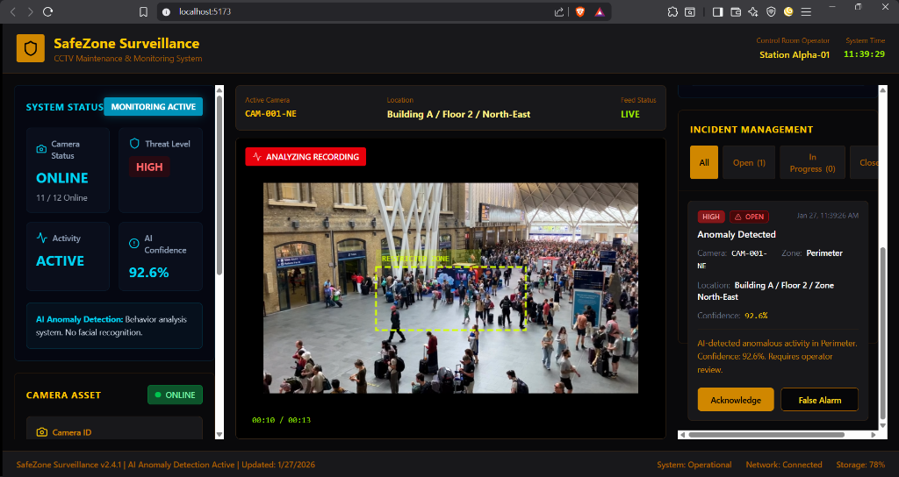
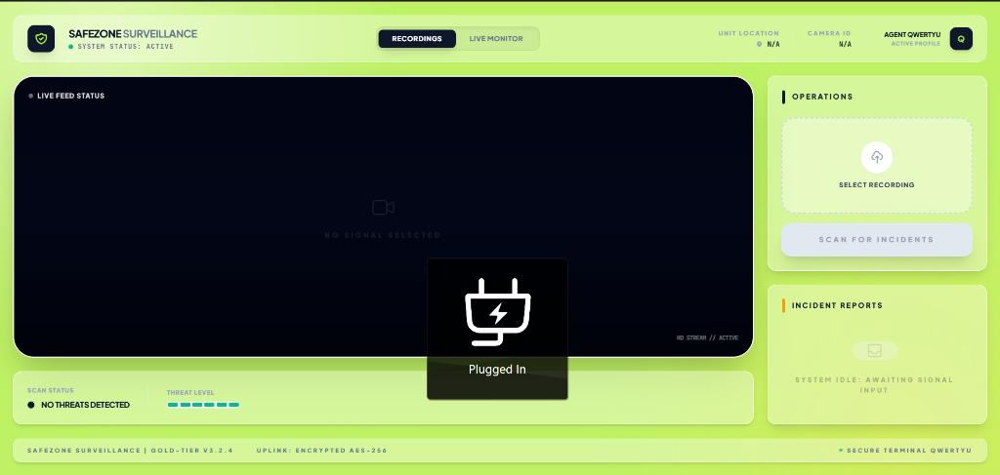
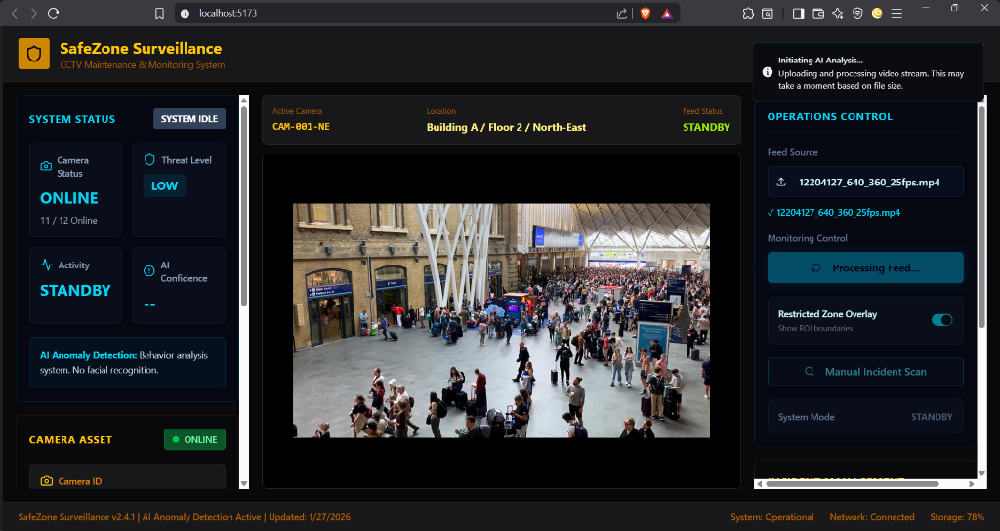

# CCTV Maintenance & Monitoring System with Real-Time Anomaly Detection (MVP)

A professional-grade CCTV monitoring solution designed to simulate a high-security control room environment. This system integrates real-time video analysis, **Motion-Guided Object Detection**, and automated anomaly alerting to assist operators in identifying potential threats in restricted zones.



## 📌 Project Overview

Traditional CCTV systems often rely on passive recording or continuous human monitoring, which is prone to fatigue and missed incidents. **SafeZone Surveillance** upgrades this paradigm by introducing **Active AI Monitoring**. 

This Minimum Viable Product (MVP) demonstrates how a modern control room can leverage Computer Vision to:
-   Automatically detect unauthorized motion in restricted areas.
-   Identify potential threats (anomalies) using unsupervised learning.
-   Provide instant visual and log-based alerts to operators.
-   Streamline incident management workflows.

## 🚀 Problem Statement

In high-security environments like military camps, prisons, or secure data centers, maintaining 100% vigilance is impossible for human operators. 
-   **Challenge**: Fatigue leads to missed security breaches.
-   **Need**: A system that never sleeps and highlights *only* the events that matter.
-   **Solution**: An AI assistant that watches the feed 24/7 and draws the operator's attention to specific "Regions of Interest" (ROI) when activity is detected.

## 💡 Solution Overview

The SafeZone Surveillance system operates on a hybrid architecture:
1.  **Frontend Dashboard**: A "Cyber-Industrial" UI that mimics a real security terminal, providing live feeds, system health status, and incident logs.
2.  **Backend AI Service**: A Python-based inference engine that processes video frames using:
    -   **MOG2 Background Subtraction**: For ultra-fast, motion-guided object detection.
    -   **Vision Transformer (ViT) + Isolation Forest**: For unsupervised anomaly scoring of detected objects.
3.  **Real-Time Alerting**: When a threat score exceeds the threshold, the system flags the frame, logs an incident, and visually highlights the intruder.

## ✨ Key Features

### 🖥️ Monitoring & Control Room UI
-   **Professional Dashboard**: Dark-mode interface designed for low-light control rooms.
-   **System Health**: Real-time status of cameras, network, and storage.
-   **Incident Management**: centralized log for tracking, acknowledging, and resolving alerts.

### 🧠 AI Anomaly Detection
-   **Motion-Guided Logic**: Efficiently scans only moving objects (people, vehicles) to reduce false positives and CPU load.
-   **Unsupervised Learning**: Detects "unusual" patterns without needing thousands of labeled "crime" images.
-   **Visual Feedback**: Draws dynamic bounding boxes—**Red** for anomalies, **Green** for safe activity.

### 🚧 Restricted Zone Monitoring
-   **ROI Logic**: Users can define specific "Restricted Zones" (e.g., a "No Standing" area).
-   **Auto-Overlay**: The system visually demarcates the zone (Yellow dashed box) and strictly monitors activity within it.

### 🔄 Dual Input Modes
1.  **Recorded Video Analysis**: Simulates a live feed by processing uploaded MP4/WebM footage.
2.  **Local Camera Demo**: Connects to the host machine's webcam for a real-time, interactive demonstration.
> *Disclaimer: This MVP uses file inputs and webcams for demonstration. It does not currently integrate with RTSP/ONVIF hardware streams.*

## 📸 Phase-by-Phase Development

This project was built in distinct phases to ensure scalability and reliability.

### Phase 1: AI Model Development
-   **Goal**: Create a model capable of distinguishing "normal" from "abnormal" without labeled training data.
-   **Outcome**: Implemented a Vision Transformer (ViT) feature extractor coupled with an Isolation Forest classifier.

### Phase 2: Restricted Zone (ROI) Logic & Visual Marking
-   **Goal**: Focus the AI's attention on specific high-risk areas.
-   **Outcome**: Implemented a configurable ROI (Region of Interest) system. The AI ignores background noise and only analyzes motion *inside* the yellow restricted zone.
-   **Visual**: The yellow dashed box in the dashboard represents this active monitoring zone.

### Phase 3: Backend API & Motion-Guided Optimization
-   **Goal**: Serve the AI model via an API and optimize for real-time performance.
-   **Outcome**: Built a FastAPI service. Replaced slow "sliding window" detection with **Motion-Guided Detection (MOG2)**, resulting in a 10x speed improvement and accurate object bounding boxes.

### Phase 4: CCTV Monitoring Dashboard (MVP UI)
-   **Goal**: Provide a realistic interface for security operators.
-   **Outcome**: Developed a React-based "Operations Center" with live video rendering, incident logs, and system status indicators.
-   **Reference**:


### Phase 5: Real-Time Playback & Integration
-   **Goal**: Connect the frontend and backend for a seamless user experience.
-   **Outcome**: Integrated video upload, processing pipelines, and real-time result streaming.
-   **Reference**:


## 🏗️ System Architecture

-   **Input**: Video File / Webcam Stream
-   **Processing**:
    -   Frame Extraction -> Resize (to 800px)
    -   Motion Detection (MOG2) -> ROI Filtering
    -   Feature Extraction (ViT) -> Anomaly Scoring (Isolation Forest)
-   **Output**: Processed frames with overlays -> WebSocket/API Stream -> Frontend Display

## 🛠️ Tech Stack

**Frontend**
-   **Framework**: React 18 (Vite)
-   **Language**: TypeScript
-   **Styling**: Tailwind CSS + Custom "Cyber" Theme
-   **Components**: Radix UI

**Backend**
-   **Server**: Node.js (Express)
-   **Database**: MongoDB (Incident Logs)
-   **Communication**: Socket.IO / REST API

**AI & ML**
-   **Language**: Python 3.11
-   **Frameworks**: FastAPI, PyTorch (TorchVision), Scikit-learn
-   **Computer Vision**: OpenCV (cv2)

## 📌 MVP Scope & Limitations

**Included**:
-   Full end-to-end video analysis pipeline.
-   Functional incident logging system.
-   Motion-guided detection optimization.

**Excluded (Future Roadmap)**:
-   **RTSP/ONVIF Support**: Direct connection to IP cameras (requires significant networking infrastructure).
-   **Multi-Camera Grid**: Simultaneous processing of 4+ streams (requires GPU acceleration).
-   **User Authentication**: Role-based access control (RBAC).

## 🔮 Future Enhancements
-   **Hardware Integration**: Add RTSP stream consumption for live IP camera support.
-   **Edge Deployment**: Optimize the Python service to run on Jetson Nano/Raspberry Pi.
-   **Mobile App**: Flutter-based companion app for security guards on patrol.

## 🚀 How to Run

1.  **Clone the Repository**:
    ```bash
    git clone https://github.com/Sowdapradeep/Safe_zone.git
    ```
2.  **Start the Backend (Node.js)**:
    ```bash
    cd server
    npm install && npm start
    ```
3.  **Start the AI Service (Python)**:
    ```bash
    cd backend
    pip install -r requirements.txt
    python app.py
    ```
4.  **Start the Frontend**:
    ```bash
    cd ..
    npm install && npm run dev
    ```
5.  **Access Dashboard**: Open `http://localhost:5173`.

---
*Built for the 2026 Advanced Engineering Hiring Challenge.*
